# Deep-Learning-and-Practice (DLP)

This repo contains the lab code in the 2022 Deep-Learning-and-Practice course.
For the detail of each lab please refer to its report.

## Lab02

Implement the back propagation from scratch and train the network to classify the linear and non-linear data.

-Linear data
>accuracy: 99%\
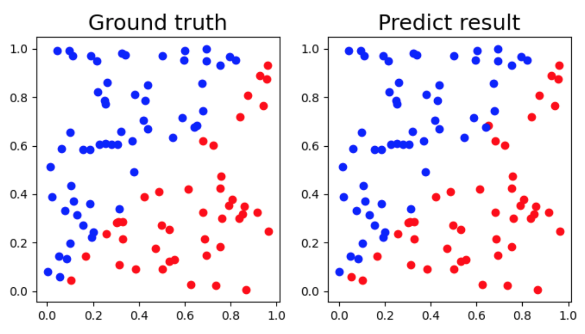

-Non-linear XOR data
>accuracy:99%\
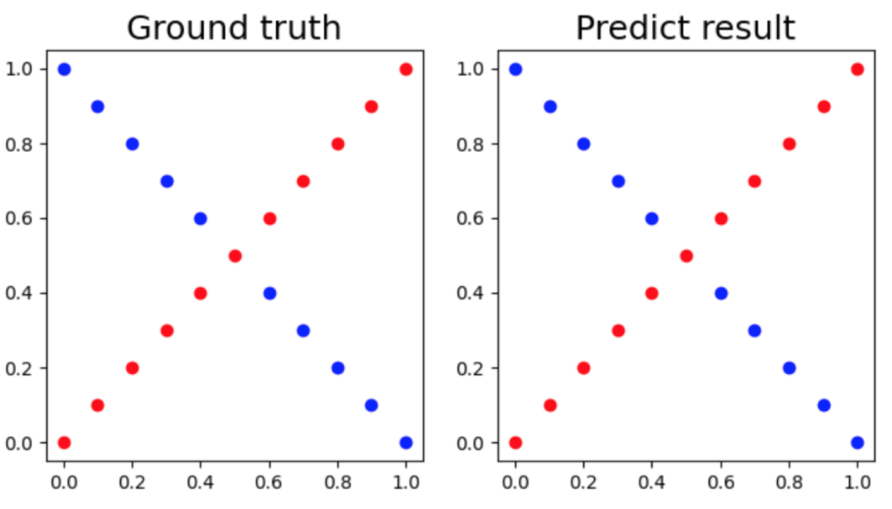

## Lab03

Mastering the 2048 game by reinforce-learning and N-tuple network.
>Score in 10000 times playing the 2048 game after training:
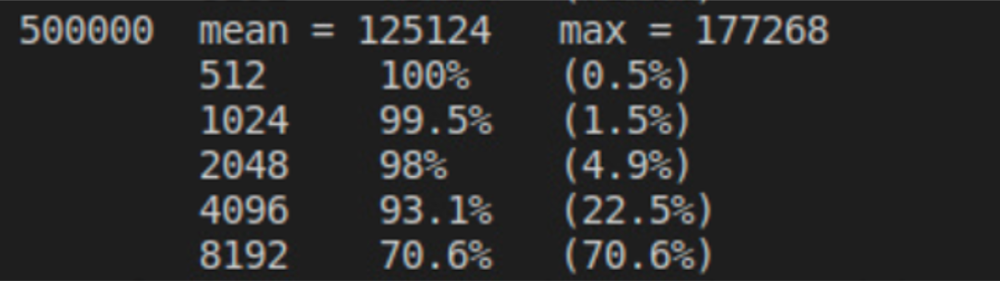

## Lab04-1
Implement the EEGNet and DeepConvNet to classify the BCI dataset. In this lab, different activation function were tested for the preformance.

-EEGNet
>accuracy: 87.4% with LeakyReLU\
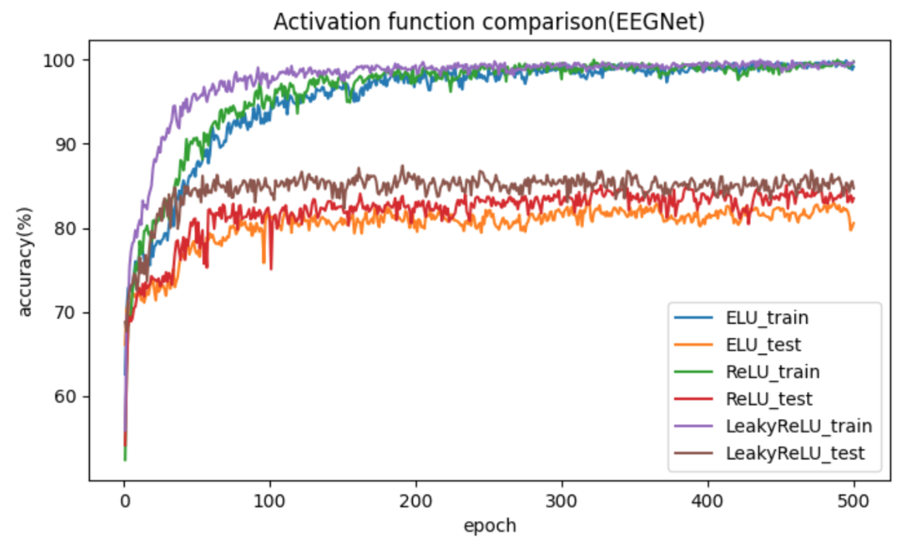

-DeepConvNet
>accuracy:81.76 with ELU\
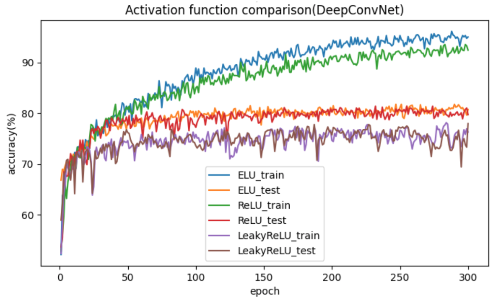

## Lab04-2
Trained the classifier with Resnet18 and Resnet50 to detect the Diabetic Retinopathy.

-Resnet18
>accuracy: 82.47% with pretrained weight\
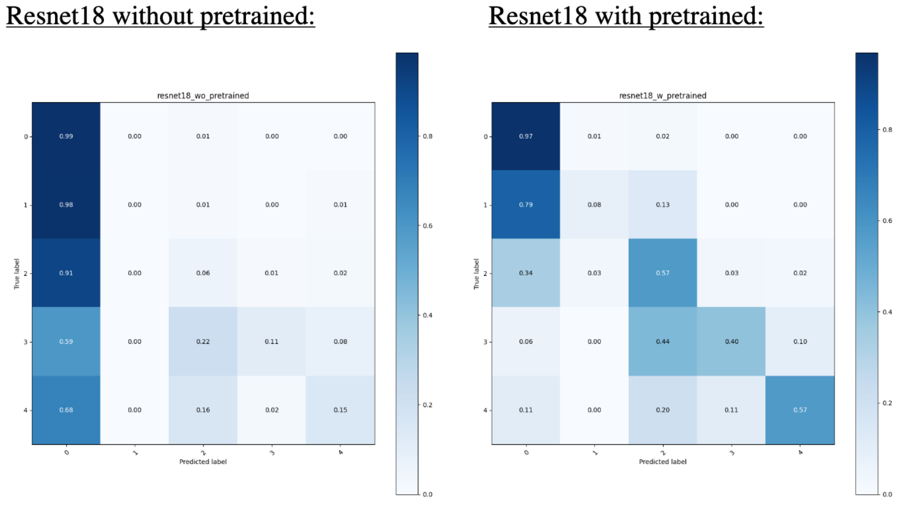

-Resnet50
>accuracy: 83.15% with pretrained weight\
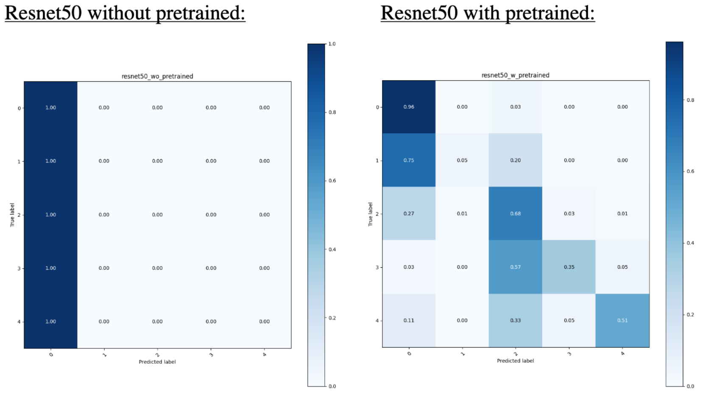

## Lab05
Inplement the conditional variational autoencoder(VAE) to predict the motion frame of robot end effector.

-Ground truth
>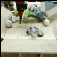

-Predict result
> psnr : 23.6 dB\

## Lab06
Master the LunarLander game with reinforce-learning, using DQN, DDPG, DDQN and TD3.

-Result
>LunarLander score of each RL model\
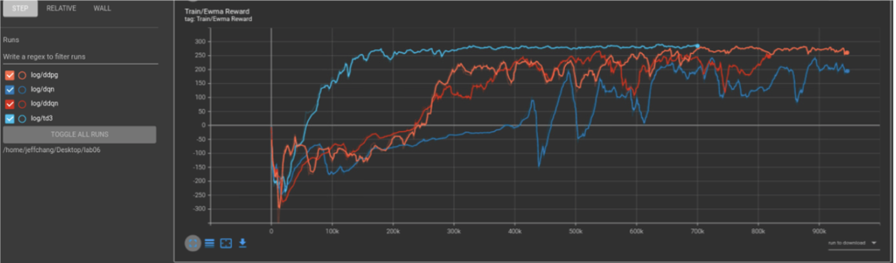

## Lab07
Implenet the conditional generative adversarial network(GAN) to generate the specific synthetic images.

-Generated images: (from only words such as 'red cylinder, blue cube... etc')
>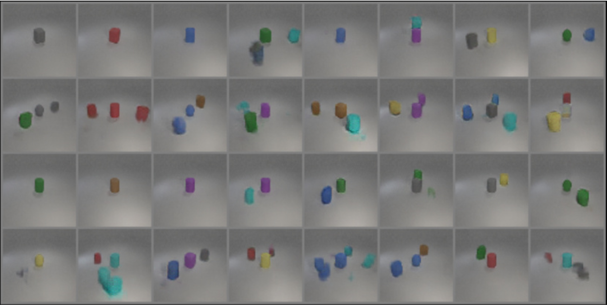

## Final
We dicussed the to pretrained a classifiaction model.
Three pretrained weights were generated from autoencoder, K-means and simCLR seperately. Then the weights were used to fine-tune and detects on covid-19 detection task. We discuss that the variety of the pretraining dataset is more important to the performance of down-stream task.

-Result
>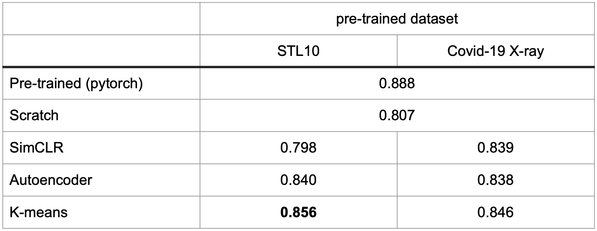
